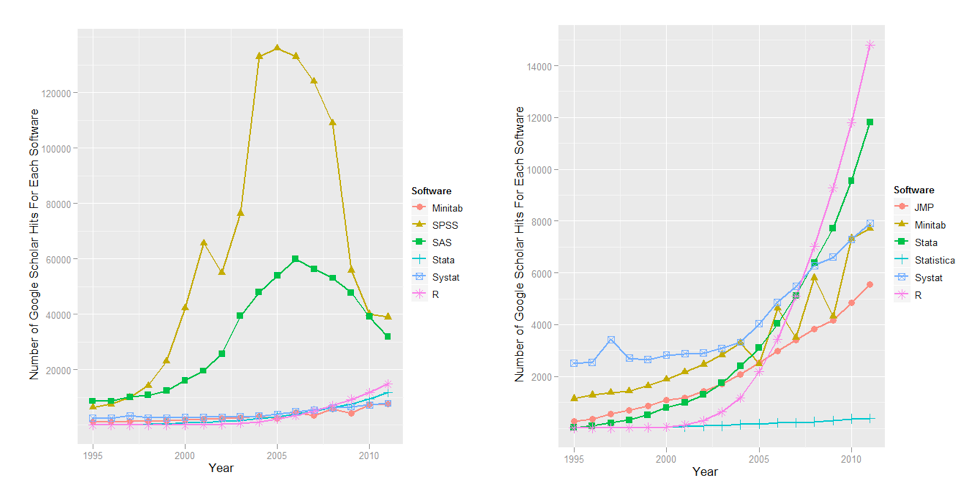

## Outline

+ Motivation
+ An introduction to the R programming language
+ The R basics and the syntax
+ Exercise set #1

---

## Why should I use R? (I)

+ R is free
+ R is open (provided you respect the GNU GPL2)
+ R is a language. In R, you do data analysis by writing functions and scripts, not by pointing and clicking. A script:
    + documents all your work
    + can instantly be re-run at any time
    + makes it easy to automate a sequence of tasks

---

## Why should I use R? (part 2)

+ Graphics and data visualization
+ A flexible statistical analysis toolkit 
+ Access to powerful, cutting-edge analytics 
+ To date > 2000 packages extending the R language in every domain
+ A robust, vibrant community. With thousands of contributors and > 2 million users around the world
+ Unlimited possibilities

---

## Need more?

---

## Getting started: the workspace

+ what variables are defined therein?
+ how to remove a variable?
+ how to save a workspace?
+ how to load it afterwards?

---

## The R help

+ Online text and HTML help
+ General and specific help pages
+ I somehow have a clue on what I want to do but I do not quite recall the name of the function I need to use

---

## The basics

+ Basic interaction mode: type an expression, R evaluates it
+ R prints the result on the console
+ Expressions work on objects: anything that can be assigned to a variable

---

## Syntax (I)

+ Getting and setting my working directory
+ Arithmetic operations
+ Logical operations
+ Constants
+ Assigning values to a variable
+ Data types:
    + Vectors 
    + Matrices
    + Factors
    + Lists
    + Data frames
+ Graphics with R

---

## Syntax (II)

+ Conditionals and loops
    + if/else
    + ifelse
    + for
    + while
    + apply/lapply
+ Writing and calling functions
+ Reading and writing files from external resources

---

## Done.

---

## Packages

+ Additional packages (outside base release) can be downloaded from CRAN
+ You can contribute your own package
+ How to download a package?
+ How to load it afterwards?

---

## Datasets

+ R and many of its packages provide (interesting) data sets
+ Let's look at some of them
+ Attaching a dataset
+ Parsing variables in a dataset to a function
